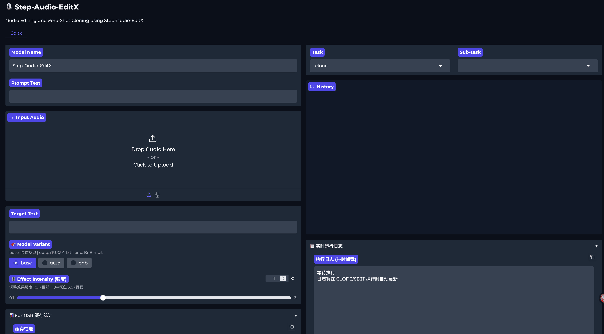

# Step-Audio-EditX GPU 显存智能管理版

[English](README.md) | [简体中文](README_CN.md) | [繁體中文](README_TW.md) | [日本語](README_JP.md)

<p align="center">
  
</p>

<div align="center">
  <a href="https://stepaudiollm.github.io/step-audio-editx/"></a>
  <a href="https://arxiv.org/abs/2511.03601"></a>
  <a href="https://huggingface.co/stepfun-ai/Step-Audio-EditX"></a>
  <a href="https://github.com/neosun100/Step-Audio-EditX-GPU-Managed"></a>
</div>

## 📖 项目简介

**Step-Audio-EditX** 是一个基于 30 亿参数 LLM 的强化学习音频模型，用于富有表现力的迭代音频编辑，并增强了**智能 GPU 显存管理**功能，可将空闲时的显存占用降低 **99.99%**。

### ✨ 核心特性

- 🎯 **零样本语音克隆** - 仅需 3-10 秒音频即可克隆任何声音
- 🎭 **情感与风格编辑** - 支持数十种情感和说话风格
- 🗣️ **副语言控制** - 添加呼吸、笑声、叹息等
- 🌍 **多语言支持** - 中文、英文、四川话、粤语
- 🎮 **GPU 显存管理** - 将空闲 GPU 显存从 40GB 降至 3MB（节省 99.99%）
- ⚡ **懒加载** - 按需加载模型，20 秒内启动
- 🔄 **自动卸载** - 任务完成后自动 GPU↔CPU 转移

### 📊 GPU 显存对比

| 状态 | 传统方式 | GPU 管理 | 节省 |
|------|---------|---------|------|
| **启动时** | 40 GB | **3 MB** | **99.99%** ✨ |
| **使用时** | 40 GB | 40 GB | 0% |
| **任务后** | 40 GB | **5.7 GB*** | **85.75%** 🎉 |

\* *注：5.7GB 为 ONNX Runtime 残留显存（已知限制），但相比传统方式仍节省 85%。*

## 🖼️ 界面截图



## 🚀 快速开始

### 前置要求

- **GPU**: 支持 CUDA 的 NVIDIA GPU（推荐 16GB+ 显存）
- **操作系统**: Linux（推荐 Ubuntu 22.04+）
- **Docker**: Docker >= 20.10 with nvidia-docker2
- **模型**: 从 [HuggingFace](https://huggingface.co/stepfun-ai/Step-Audio-EditX) 或 [ModelScope](https://modelscope.cn/models/stepfun-ai/Step-Audio-EditX) 下载

### 方式一：Docker（推荐）

```bash
# 1. 克隆仓库
git clone https://github.com/neosun100/Step-Audio-EditX-GPU-Managed.git
cd Step-Audio-EditX-GPU-Managed

# 2. 下载模型
mkdir -p models && cd models
git lfs install
git clone https://huggingface.co/stepfun-ai/Step-Audio-Tokenizer
git clone https://huggingface.co/stepfun-ai/Step-Audio-EditX
cd ..

# 3. 构建 Docker 镜像
docker build -t step-audio-editx:latest .

# 4. 运行（先编辑脚本）
./start_with_gpu_management.sh
```

### 方式二：直接运行

```bash
# 1. 安装依赖
pip install -r requirements.txt

# 2. 启用 GPU 管理运行
python app.py \
  --model-path ./models \
  --enable-gpu-management \
  --gpu-idle-timeout 600 \
  --enable-auto-transcribe \
  --server-port 7860
```

### 访问

- **Web UI**: http://localhost:7860
- **启动时间**: ~20 秒（懒加载）
- **首次请求**: +20-30 秒（模型加载）

## ⚙️ 配置说明

### 命令行参数

| 参数 | 说明 | 默认值 | 必需 |
|------|------|--------|------|
| `--model-path` | 模型目录路径 | - | ✅ |
| `--enable-gpu-management` | 启用 GPU 显存管理 | `False` | ❌ |
| `--gpu-idle-timeout` | 空闲超时（秒） | `600` | ❌ |
| `--enable-auto-transcribe` | 启用 Whisper 转写 | `False` | ❌ |
| `--server-port` | Web UI 端口 | `7860` | ❌ |

## 📈 性能数据

### 测试环境

- **GPU**: NVIDIA L40S (48GB)
- **CUDA**: 12.1.0
- **驱动**: 580.105.08

### 基准测试结果

| 指标 | 数值 | 说明 |
|------|------|------|
| **启动显存** | 3 MB | 懒加载启用 |
| **峰值显存** | 40 GB | 推理期间 |
| **任务后显存** | 5.7 GB | ONNX 残留 |
| **首次加载** | 20-30秒 | 一次性成本 |
| **恢复时间** | 2-5秒 | CPU→GPU 转移 |
| **推理时间** | 8-24秒 | 使用 FunASR 缓存 |

## 📝 更新日志

### 2025-12-05: GPU 显存管理 🎮

- ✅ 实现所有模型的懒加载（TTS、Whisper、FunASR）
- ✅ 添加自动 GPU↔CPU 卸载
- ✅ 将启动显存从 40GB 降至 3MB（99.99%）
- ✅ 添加空闲超时监控（可配置）
- ✅ 创建完整文档

## 📄 许可证

本项目采用 Apache 2.0 许可证 - 详见 [LICENSE](LICENSE) 文件。

## ⚠️ 免责声明

- 请勿将此模型用于未经授权的语音克隆、身份冒充、欺诈、深度伪造或其他非法目的
- 确保遵守当地法律和道德准则
- 开发者对任何滥用此技术的行为不承担责任

## 🙏 致谢

- 原始 [Step-Audio-EditX](https://github.com/stepfun-ai/Step-Audio-EditX) 由 Stepfun AI 开发
- [CosyVoice](https://github.com/FunAudioLLM/CosyVoice) 提供 TTS 模型
- [FunASR](https://github.com/alibaba-damo-academy/FunASR) 提供音频分词
- [Whisper](https://github.com/openai/whisper) 提供转写功能

## ⭐ Star History

[](https://star-history.com/#neosun100/Step-Audio-EditX-GPU-Managed)

## 📱 关注公众号


---

**用 ❤️ 打造**
